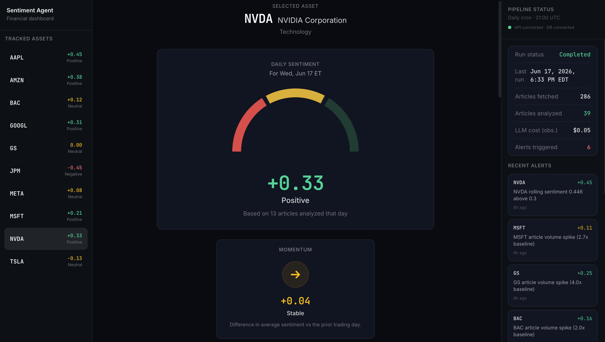
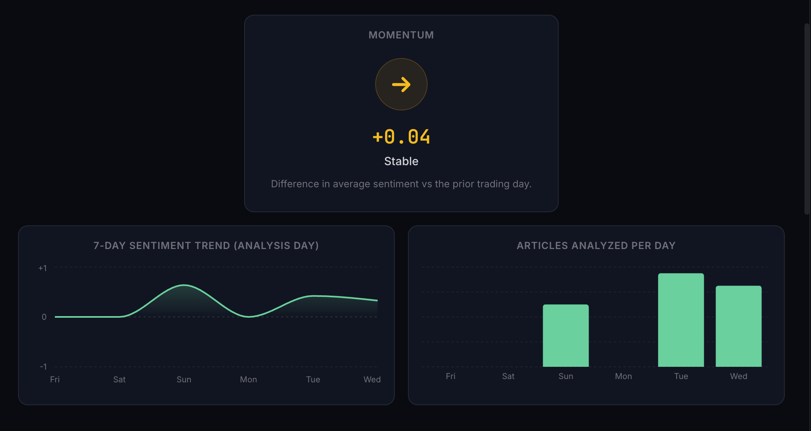
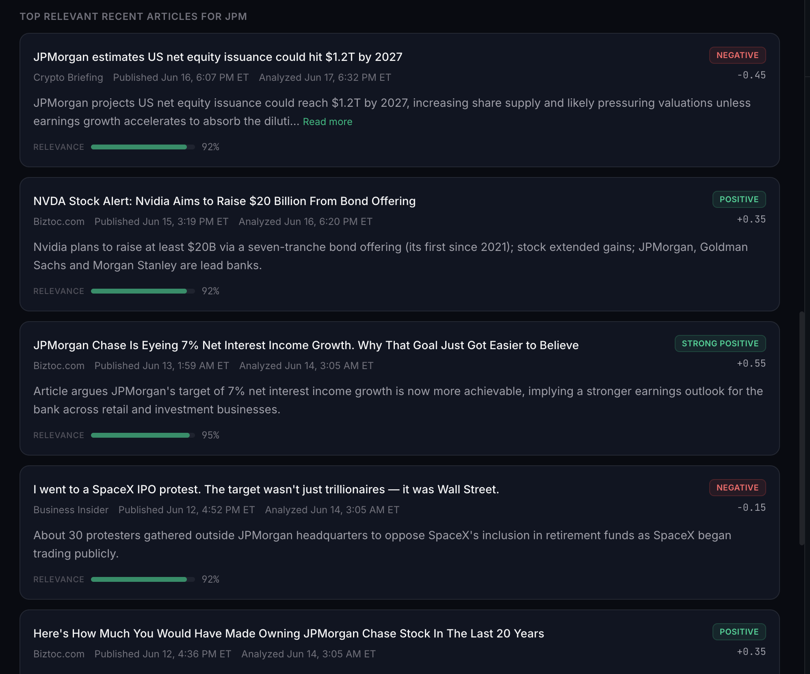
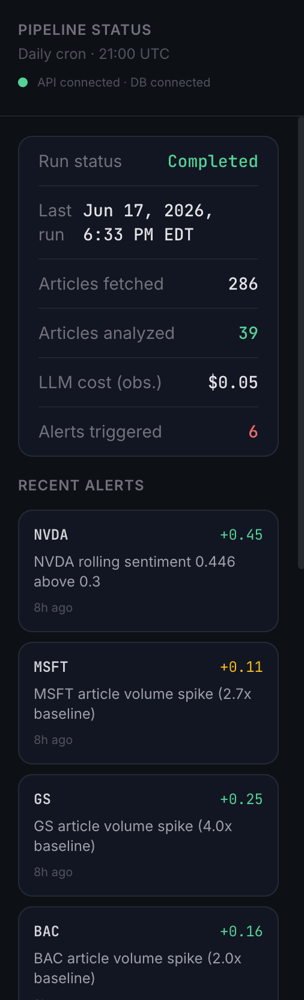
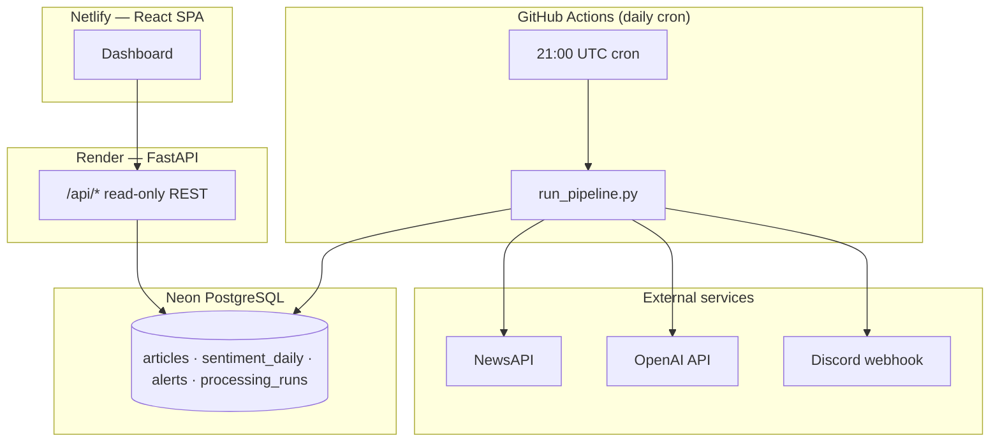
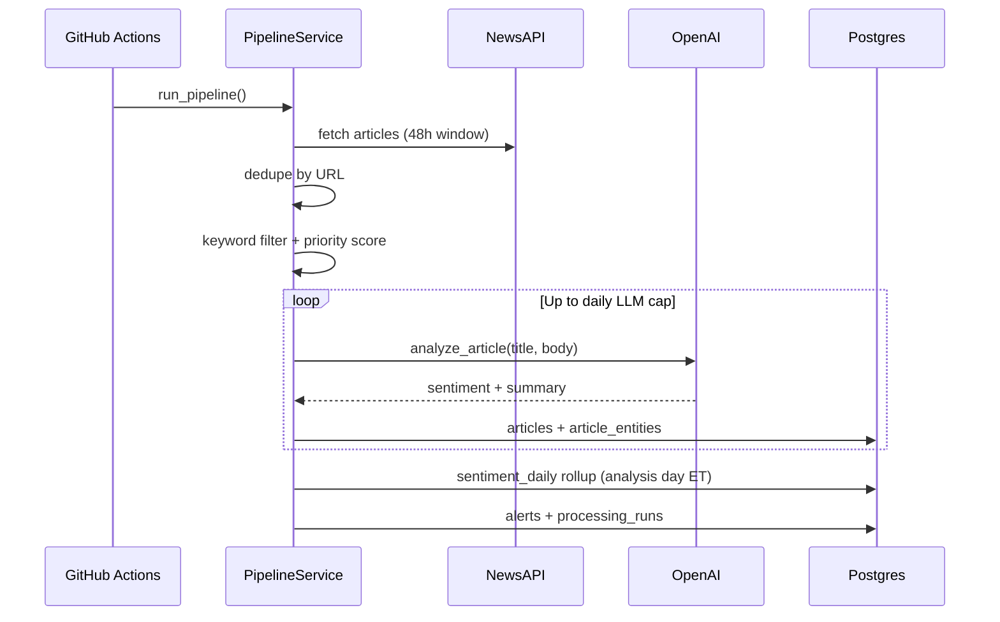
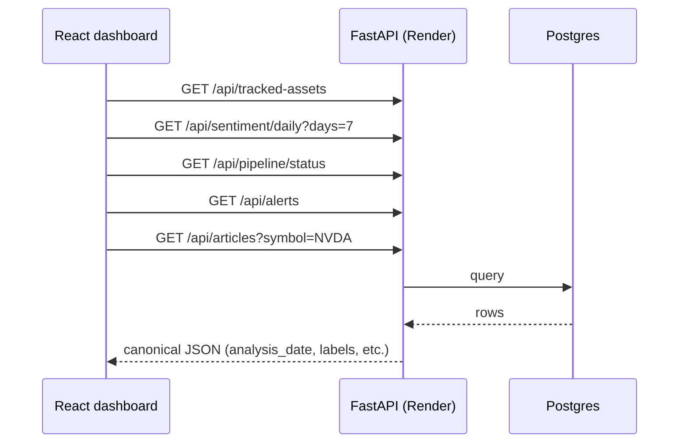
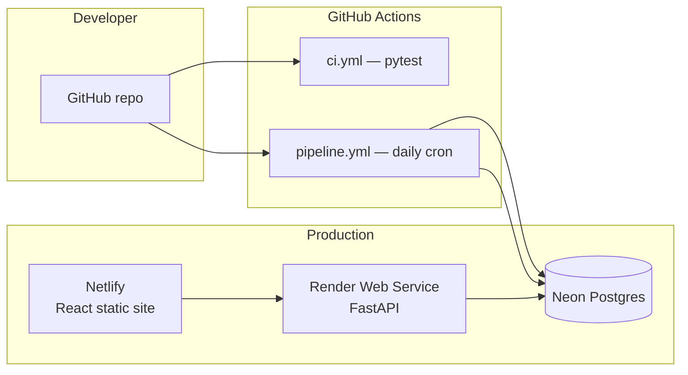

# Financial Sentiment Agent
Automated financial news ingestion, LLM sentiment analysis, and a live dashboard for tracked equities.


**Live Demo:** https://tubular-lolly-084b55.netlify.app/


## Overview

This project watches a portfolio of major US equities, pulls financial news every day, and scores how positive or negative the coverage is using OpenAI. Results land in PostgreSQL, roll up into daily sentiment trends, and can trigger alerts when sentiment or article volume spikes.

On the read side, a FastAPI backend serves the data and a React dashboard lets you explore sentiment gauges, charts, recent articles, and pipeline status for each ticker.

**What it does, end to end:**

1. Fetches financial news from NewsAPI on a daily schedule
2. Filters articles to tracked tickers using keyword confidence scoring
3. Sends high-priority articles to OpenAI for sentiment and summaries
4. Stores results and rolls up daily sentiment by analysis day (US Eastern)
5. Fires alerts on rolling sentiment thresholds and volume spikes
6. Exposes everything through a read-only API and React dashboard

**Default tracked tickers:** NVDA, AAPL, MSFT, GOOGL, AMZN, META, TSLA, JPM, BAC, GS

**Stack at a glance:** Python pipeline · FastAPI · PostgreSQL (Neon) · GitHub Actions · React · Vite · Tailwind

---

## Screenshots

**Dashboard** — sidebar, header, and sentiment gauge for the selected ticker.



**Charts** — momentum and 7-day sentiment & volume.



**Articles** — recent news feed with LLM summaries and sentiment scores.



**Pipeline** — latest run status and alerts panel.



---

## Architecture



---

## Tech stack

| Layer | Technologies |
|-------|----------------|
| **Pipeline** | Python 3.12, SQLAlchemy, Alembic, NewsAPI, OpenAI SDK |
| **API** | FastAPI, Uvicorn, Pydantic v2, SlowAPI rate limiting |
| **Database** | PostgreSQL (Neon), UUID hub schema, pooled connections |
| **Orchestration** | GitHub Actions (CI + daily pipeline cron) |
| **Frontend** | React 19, TypeScript, Vite 8, Tailwind CSS v4, Recharts |
| **Deploy** | Render (API), Netlify (UI), GitHub Secrets (pipeline env) |

---

## Data flow

### Pipeline (write path)



| Step | Description |
|------|-------------|
| **Fetch** | General financial query + per-ticker NewsAPI supplement |
| **Dedupe** | Skip URLs already in `articles` |
| **Filter** | Map articles to tickers via keyword confidence (≥ 0.90) |
| **Rank** | Priority score gates LLM budget — newest, most relevant first |
| **Analyze** | LLM returns structured sentiment (−1…+1) and summary |
| **Roll up** | Daily `sentiment_daily` keyed by `processed_at` calendar day (ET) |
| **Alert** | 7-day rolling sentiment + volume spike rules; optional Discord |

### Dashboard (read path)



The frontend **does not recompute calendar buckets** — dates and ET labels come from the API.

---

## Deployment

[](https://github.com/Adil-Bee200/financial-sentiment-agent/actions/workflows/ci.yml)
[](https://github.com/Adil-Bee200/financial-sentiment-agent/actions/workflows/pipeline.yml)

| | |
|---|---|
| **API** | [financial-sentiment-agent.onrender.com](https://financial-sentiment-agent.onrender.com) |
| **API docs** | [OpenAPI / Swagger](https://financial-sentiment-agent.onrender.com/docs) |
| **Dashboard** | Deploy frontend to Netlify (see below) |



| Service | Role | Config |
|---------|------|--------|
| **GitHub Actions** | Run pipeline, migrations, seeds | `DATABASE_URL`, `OPENAI_API_KEY`, `NEWS_API_KEY`, `DISCORD_WEBHOOK_URL` |
| **Neon** | Primary datastore | Pooled `DATABASE_URL` |
| **Render** | Read-only API | Root: `backend`, start: `uvicorn app.main:app --host 0.0.0.0 --port $PORT` |
| **Netlify** | Frontend SPA | Base: `frontend`, publish: `dist`, `VITE_API_URL` → Render URL |

**Render env (minimum):** `DATABASE_URL`

**Netlify env:** `VITE_API_URL=https://your-api.onrender.com`

---

## API reference

Base URL: `https://financial-sentiment-agent.onrender.com`

| Method | Path | Description |
|--------|------|-------------|
| `GET` | `/health` | API + DB connectivity |
| `GET` | `/api/tracked-assets` | Monitored tickers |
| `GET` | `/api/sentiment/daily` | Analysis-day rollups (`?symbol=&days=`) |
| `GET` | `/api/articles` | Articles for one ticker (`?symbol=` required) |
| `GET` | `/api/alerts` | Recent alerts |
| `GET` | `/api/pipeline/status` | Latest `processing_runs` metrics |

Interactive docs: [`/docs`](https://financial-sentiment-agent.onrender.com/docs)

### Example responses

**`GET /api/tracked-assets`**

```json
[
  {
    "ticker_id": "dd81700f-6dc0-431d-a54d-8e298d159776",
    "symbol": "NVDA",
    "company_name": "NVIDIA Corporation",
    "sector": "Technology",
    "created_at": "2026-06-14T05:30:13.386335Z"
  }
]
```

**`GET /api/sentiment/daily?symbol=NVDA&days=7`**

```json
[
  {
    "symbol": "NVDA",
    "analysis_date": "2026-06-17",
    "analysis_date_label": "Wed, Jun 17",
    "chart_axis_label": "Wed",
    "timezone": "America/New_York",
    "avg_sentiment": 0.291,
    "article_count": 11,
    "momentum": 0.042,
    "std_div": 0.18,
    "last_run_at": "2026-06-17T22:33:57.340828Z",
    "is_current_analysis_day": true
  }
]
```

**`GET /api/articles?symbol=NVDA&limit=1`**

```json
[
  {
    "article_id": "290069a1-bf54-4180-92b3-b096cfa564a5",
    "title": "Nvidia's Jensen Huang says society needs 'new social norms' in the age of AI",
    "source": "Japan Today",
    "url": "https://example.com/article",
    "published_at": "2026-06-16T21:44:20Z",
    "analyzed_at": "2026-06-17T22:33:23.700000Z",
    "published_at_label": "Jun 16, 5:44 PM ET",
    "analyzed_at_label": "Jun 17, 6:33 PM ET",
    "summary": "Nvidia CEO Jensen Huang says society must adopt new social norms as AI advances.",
    "symbol": "NVDA",
    "sentiment_score": 0.5,
    "confidence": 0.92,
    "relevance_score": 0.92
  }
]
```

**`GET /api/pipeline/status`**

```json
{
  "run_id": "d82f283d-ce2f-466c-9819-49037e6a6d0f",
  "status": "completed",
  "last_run_at": "2026-06-17T22:33:57.340828Z",
  "started_at": "2026-06-17T22:30:04.728530Z",
  "timezone": "America/New_York",
  "articles_fetched": 286,
  "articles_analyzed": 39,
  "estimated_llm_cost": 0.05,
  "alerts_triggered": 6
}
```

**`GET /health`**

```json
{
  "status": "ok",
  "database": "connected"
}
```

---

## Local development

### Prerequisites

- Python 3.12+
- Node.js 20+
- PostgreSQL (or Neon connection string)
- NewsAPI and OpenAI API keys (pipeline only)

### Backend

```bash
cd backend
python -m venv .venv
source .venv/bin/activate          # Windows: .venv\Scripts\activate
pip install -r requirements.txt
cp env.example .env                # edit DATABASE_URL, API keys
alembic upgrade head
python -m scripts.seed_assets
uvicorn app.main:app --reload --port 8000
```

### Frontend

```bash
cd frontend
npm install
echo "VITE_API_URL=http://localhost:8000" > .env.local
npm run dev
```

Open [http://localhost:5173](http://localhost:5173)

### Tests

```bash
cd backend && pytest
```

### Run pipeline manually

```bash
cd backend
source .venv/bin/activate
python -m scripts.run_pipeline
```

### Recompute sentiment rollups

```bash
python -m scripts.reaggregate_sentiment --days 7
```

---

## Project structure

```
financial-sentiment-agent/
├── backend/
│   ├── app/
│   │   ├── api/              # FastAPI routes
│   │   ├── core/             # config, DB, timezone utilities
│   │   ├── models/           # SQLAlchemy models
│   │   ├── services/         # pipeline, LLM, sentiment, alerts
│   │   └── schemas/          # Pydantic response models
│   ├── alembic/              # migrations
│   ├── scripts/              # run_pipeline, seed_assets, reaggregate
│   └── tests/
├── frontend/
│   ├── src/
│   │   ├── api/              # typed API client
│   │   ├── components/       # dashboard UI
│   │   └── hooks/            # useDashboard
│   └── netlify.toml
├── .github/workflows/
│   ├── ci.yml                # pytest on push
│   └── pipeline.yml          # daily news pipeline
└── docs/screenshots/         # README images
```

---

## Design notes

- **Analysis day (ET):** Daily sentiment is grouped by when articles were *analyzed* (`processed_at`), not when they were published — so the gauge matches each pipeline run’s calendar day.
- **LLM budget:** Per-run and per-day caps with priority scoring limit OpenAI cost.
- **Cold starts:** The Netlify UI loads immediately and retries while the Render free-tier API wakes up.

---

## Further reading

- [backend/SETUP.md](backend/SETUP.md) — backend env, timezone, migrations
- [frontend/README.md](frontend/README.md) — frontend-specific setup
- [docs/screenshots/README.md](docs/screenshots/README.md) — how to add README images

---

## License

MIT — see repository for details.
